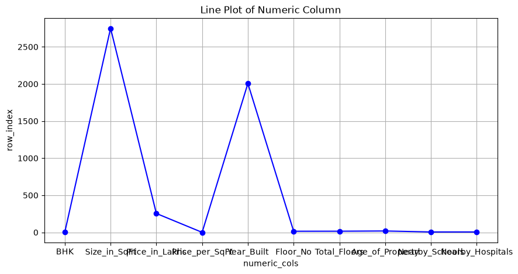
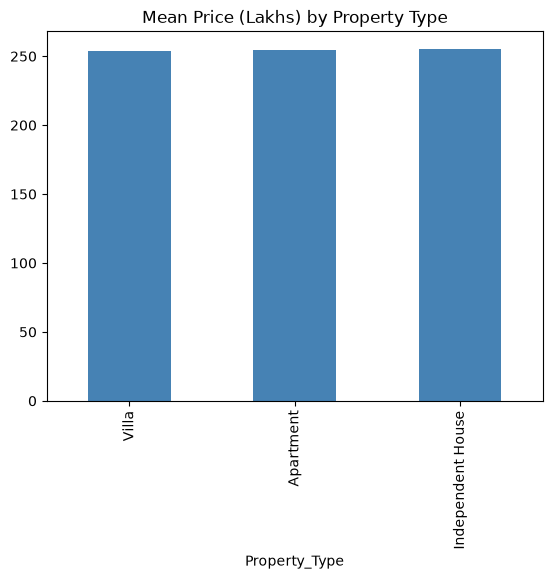
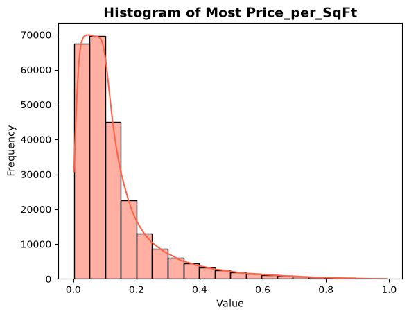
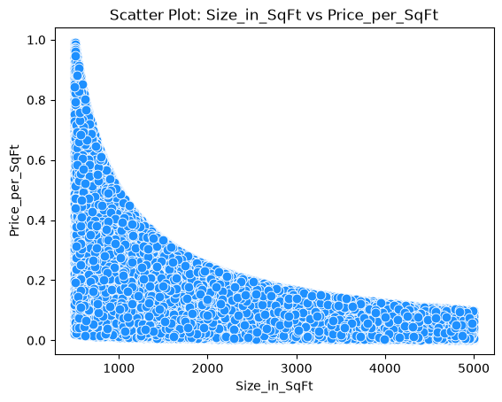
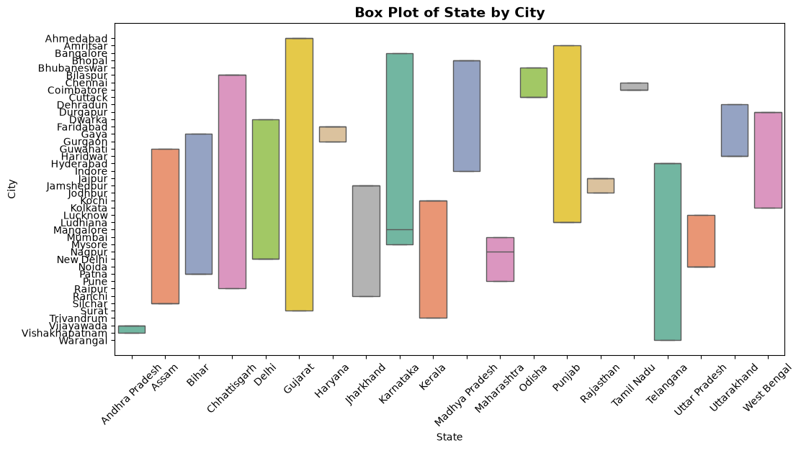
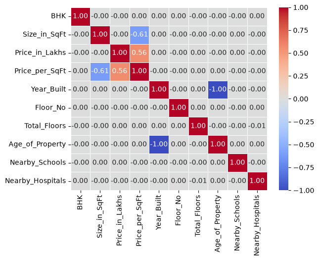

# *India House Price Prediction Using Machine Learning*

 # *Project Overview* : 
This project predicts house prices in India using machine learning. It analyzes property 
features such as location, size, number of bedrooms, age of the property, and nearby 
facilities to estimate the house price. The project follows an end-to-end pipeline from 
data collection to model building to create a reliable price prediction system

 # *Problem Statement* : 
 House prices in India change a lot from city to city, and even between nearby buildings. Many buyers and sellers depend on brokers or old listings for pricing, which often leads to wrong estimates and weak negotiation.
This project uses machine learning to predict a fair house price based on simple details like city, locality, size, number of bedrooms, bathrooms, furnishing, floor, and property age.
The goal is to give buyers, sellers, and platforms a quick and fair price estimate, making the buying and selling process easier and more transparent.
Success means: low prediction error and accurate results, along with a simple app/API that gives instant price predictions.

 # *Business Understanding* :
 House prices in India are hard to judge fairly — they depend on city, locality, size, and amenities, and most buyers just rely on broker quotes. This project uses machine learning to predict a fair price for a property based on its features, helping buyers, sellers, and platforms make better, data-backed decisions.

 # *Dataset Information* :

The dataset contains house listing details from Indian cities, used to train the price 
prediction model.

- *Source:* Kaggle (https://www.kaggle.com/datasets/ankushpanday1/india-house-price-prediction)
- *Size:* ~2.5 lakh rows, *23* columns
- *Target column:* price (Price_in_Lakhs)
- *Features:*  ID,
State,
City,
Locality,
Property_Type,
BHK,
Size_in_SqFt,
Price_in_Lakhs,
Price_per_SqFt,
Year_Built,
Furnished_Status,
Floor_No,
Total_Floors,
Age_of_Property,
Nearby_Schools,
Nearby_Hospitals,
Public_Transport_Accessibility,
Parking_Space,
Security,
Amenities,
Facing,
Owner_Type,
Availability_Status,

 # *Project Structure* :
 - Data Acquisition, Cleaning, and Exploratory Analysis
 - Supervised Machine Learning Model — Build, Train, and Evaluate
 - Advanced Modeling — Ensembles, Tuning, and Full ML Pipeline
 - LLM-Powered Feature: Structured Extraction, Tabular Batch Scoring, or Model Prediction Explanation
 
  # *Techonologies used* :
  - python 
  -  Pandas numpy ,matplotlib,seabron ,
  - scikit-learn 
  - LLM ,prompt engineeing ,json schema

  # *project Workflow* :

# PART 1 — Data Loading, Cleaning & Exploratory Data Analysis

**Notebook:** `task1_load_dataset_EDA.ipynb`

## 1. Loading and Inspecting the Data

The dataset was loaded into a pandas DataFrame and immediately inspected —
the first five rows, the column data types, and the overall shape — before
any cleaning was attempted. This is standard practice: you cannot clean
data you have not looked at first.

**Result:** the dataset contains **250,000 rows and 23 columns**. On load,
10 columns were numeric (ID, bedroom count, size, price, price per square
foot, year built, floor number, total floors, property age, nearby schools,
nearby hospitals) and 13 were text columns (state, city, locality, property
type, furnishing status, transport accessibility, parking, security,
amenities, facing, owner type, availability status). Every column loaded
with a sensible type on the first pass — no columns were obviously
mis-parsed.

## 2. Null Value Analysis

Missing values were counted for every column, and that count was also
converted into a percentage of the total row count, so that a null report
table could be produced showing each column's name, missing value count,
and missing percentage side by side.

**Result:** every one of the 23 columns returned **zero missing values
(0.00%)**. No column came anywhere close to the 20% threshold that would
have flagged it as unreliable, and there was nothing to fill in.

**Why median rather than mean, as a general policy for imputation:** the
mean of a column is pulled toward whichever tail is heavier. For a
right-skewed column like price-per-square-foot (see the skewness analysis
below), filling a gap with the mean would insert a value inflated by a
handful of expensive-per-square-foot outlier listings, not a value
representative of a typical property. The median is the middle value once a
column is sorted, so a few extreme values cannot drag it around — it stays
representative of the "typical" row regardless of how skewed the
distribution is. This is why median was adopted as the imputation policy,
even though this particular dataset turned out to have no missing values to
apply it to.

## 3. Duplicate Detection and Removal

The dataset was checked for fully duplicated rows, and any duplicates found
would have been dropped.

**Result:** zero duplicate rows were found. No rows were removed, so the
row count stayed at 250,000 both before and after this step, and the null
percentage table from the previous step remains unchanged, since nothing
was deleted.

## 4. Data Type Correction and Memory Optimization

The property ID column had loaded as a numeric integer type, but an ID is
an identifier, not a quantity that should ever be averaged, summed, or fed
into a correlation calculation. It was converted to a plain text/string
type to make its role explicit and to prevent it from being accidentally
treated as a numeric feature later in the pipeline.

Every low-cardinality, repetitive text column — state, city, locality,
property type, furnishing status, transport accessibility, parking,
security, amenities, facing, owner type, and availability status — was
converted from a generic text type to pandas' dedicated `category` type.
Memory usage was measured before and after this conversion.

**Result:** memory usage dropped from **187.03 MB to 35.48 MB**, an
**~81% reduction**. A category type stores each column's repeated values
only once, in an internal lookup table, with every row holding a small
pointer into that table instead of a full copy of the text — a large saving
for any column where a small number of unique values repeat across a huge
number of rows, which describes every categorical column here.

## 5. Descriptive Statistics and Skewness

The price-per-square-foot column was recomputed directly from price and
size, to guarantee the three related price columns stay internally
consistent. Full descriptive statistics (count, mean, standard deviation,
min, quartiles, max) were then generated for every numeric column, followed
by the skewness of each one.

**Result:** price-per-square-foot stood out with a skewness of **+2.32** —
strongly right-skewed. Every other numeric column (bedroom count, size,
price, year built, floor number, total floors, property age, nearby
schools, nearby hospitals) came back essentially symmetric, with skewness
values clustered right around zero.

**What this skew means:** the bulk of listings sit at a low
price-per-square-foot, with a long tail of listings priced
disproportionately high per square foot stretching the distribution's
right side out — a shape later confirmed visually by the histogram.
**Consequence for mean imputation:** because that long tail pulls the
average upward, filling a missing value in this column with the column
mean would systematically overstate what a typical listing's
price-per-square-foot actually looks like. The median, sitting at the
middle rank rather than being dragged by extreme values, is the safer,
more representative statistic for this specific column — a difference made
concrete later, where the mean came out to 0.13 against a median of 0.09.

## 6. Outlier Detection with the IQR Method

Outliers were identified using the standard interquartile range rule: the
25th and 75th percentile of a column define a "typical middle range," and
any value sitting more than 1.5 times that range below the 25th percentile
or above the 75th percentile is flagged as a statistical outlier. This was
applied specifically to price and to price-per-square-foot, and then swept
across every numeric column for a full report.

**Result:** the price column returned **zero outliers** — its full range
fits comfortably inside the typical-range fences, with no long tail
sticking out. The price-per-square-foot column returned **19,723
outliers**, close to 8% of all rows.

**Interpretation:** the zero-outlier result for price reflects a
distribution with no long tail — the values are fairly evenly spread with
nothing extreme on either end. The large outlier count for
price-per-square-foot is the direct numerical consequence of the skew
identified above: a genuinely long right tail naturally pushes a large
number of values outside a fence built around the middle 50% of the data,
which is expected behavior for a skewed column rather than a sign of
corrupted data.

**Decision carried forward:** these flagged rows were not dropped.
Price-per-square-foot is itself a derived ratio (price divided by size)
rather than an independently measured feature, so its "outliers" mostly
reflect small, lower-priced properties where division naturally produces a
larger ratio, not erroneous data entry. This column will also not be used
as a predictive feature later on, since it is mathematically derived from
the price target itself and would leak the answer into the model — so the
flagged rows are simply retained as-is, with no capping applied.

## 7. Visualizations

Five chart types were produced to visually confirm the numeric findings
above.

**Line plot:** the mean value of the first ten numeric columns was plotted
as a connected line, with column names along the horizontal axis. The line
spikes sharply at the size column, since its typical value (in the
thousands of square feet) sits on a completely different numeric scale
than columns like bedroom count (1 to 5) or price (in the hundreds).
Rather than tracking one variable's trend over time or row order, this
chart is really comparing several columns' raw average magnitudes side by
side — it confirms visually what the descriptive statistics already showed
numerically: no column has an average that looks anomalous relative to its
own typical range.



**Bar chart:** average price was compared across the three property types
— apartment, independent house, and villa. All three bars came out
visually almost identical, sitting in the 250–255 lakh range — property
type has essentially no effect on average price in this dataset.



**Histogram:** the price-per-square-foot column — the most skewed column
identified earlier — was plotted as a 20-bin histogram with a smoothed
density curve overlaid. **Shape:** a tall peak around 0.05–0.10, followed
by a long, steadily thinning tail stretching out toward 1.0. This is the
textbook shape of a right-skewed distribution, and it visually confirms the
+2.32 skew value computed numerically.



**Scatter plot:** size and price-per-square-foot were plotted against each
other, since they were expected to be related. **Direction and strength:**
a clear negative, moderate-to-strong relationship — as size increases,
price-per-square-foot decreases, following a curved rather than a
straight-line path, matching the -0.61 correlation found in the heat map
below. This relationship is mechanical rather than a genuine market signal:
since price-per-square-foot is calculated by dividing price by size, and
price itself is largely independent of size in this data, dividing by a
larger size figure necessarily produces a smaller ratio.



**Box plot:** state was compared against city. **A note on this chart,
stated plainly:** a proper box plot needs a numeric column on one axis so
that quartiles, medians, and whiskers can actually be computed. This
version compares two category columns against each other, which runs
without an error but does not produce a genuine statistical box-and-whisker
plot — it visualizes category co-occurrence rather than the spread of a
numeric variable, and a warning was raised during plotting as a result. For
a fully correct version of this chart, price should sit on the numeric axis
against a categorical column like property type or furnishing status,
which would show the actual median and spread of price per category. This
is flagged here transparently rather than describing the chart as
something it isn't.


## 8. Correlation Heat Map

A full correlation matrix was computed across every numeric column and
visualized as an annotated heat map.

**Result:** the single strongest relationship in the entire matrix was
between year built and property age, at a **perfect -1.0 correlation**.
The next strongest was between size and price-per-square-foot, at **-0.61**,
followed by price and price-per-square-foot at **+0.56**. Every other pair
of columns showed a correlation below 0.01 — essentially no relationship at
all.

**Is this causal, or could a third variable explain it?** The perfect -1.0
correlation between year built and property age is not a causal or market
relationship at all — it is arithmetic. Property age is computed directly
from year built (the current reference year minus the year the property
was built), so knowing one variable tells you the other exactly, by
construction. A plausible way to describe this without invoking causality
is that both columns simply encode the same underlying fact — when the
building was constructed — through two mechanically linked
representations, rather than describing any independent real-world
relationship. The next-strongest pair, size against price-per-square-foot,
is likewise a mechanical consequence of how price-per-square-foot was
calculated, not a genuine market effect.


## 9a. Imputation Strategy Comparison — Mean vs. Median

The two columns with the highest absolute skewness were identified, and
their mean and median were computed and printed side by side before any
imputation was applied, followed by median-based filling of any remaining
nulls in those two columns.

**Result:** the two most skewed columns were price-per-square-foot and
price. For price-per-square-foot, the mean came out to **0.13** against a
median of **0.09** — a visible, real gap caused by the column's strong
positive skew. For price, the mean and median were nearly identical
(**254.59** versus **253.87**), reflecting that column's near-zero skew.
After the imputation step, a null check confirmed **zero remaining nulls**
in both columns.

**Justification:** because price-per-square-foot is strongly positively
skewed, its mean is visibly pulled upward relative to its median by the
long right tail of high-price-per-square-foot listings — making the median
the more representative central-tendency statistic, and the one adopted
for imputation. Price, with essentially no skew, would have worked equally
well with either statistic, so the median was still used for consistency
with the overall policy.

## 9b. Spearman vs. Pearson Correlation

Alongside the Pearson correlation matrix computed earlier, a Spearman
rank-based correlation matrix was also computed across the same numeric
columns. The absolute difference between the two matrices was calculated
for every pair of columns, and the three pairs with the largest gap were
identified.

**Result:** the largest gap by far was between price and
price-per-square-foot, where Spearman noticeably exceeded Pearson. The
second largest gap was between price-per-square-foot and size, where the
two measures were much closer to each other. The third-largest gap was
between two essentially unrelated columns, where both measures sat near
zero.

**Interpretation:** where Spearman clearly exceeds Pearson, as with price
against price-per-square-foot, the relationship is monotonic but
non-linear — the two variables consistently move in the same direction in
rank order, but not in a strict straight-line, proportional way, which
fits with price-per-square-foot being built from a division rather than a
linear formula. Where the two measures are close to each other, as with
price-per-square-foot against size, the relationship behaves in an
approximately linear fashion across the observed range, even though it
originates from an inverse relationship. Where both measures sit near
zero, there is no real relationship to speak of either way.

**Which measure to rely on going forward:** Spearman is the more
trustworthy measure for feature-selection guidance in the modeling stage,
since it is not distorted by the non-linear, ratio-based construction of
price-per-square-foot. In practice, though, every genuine candidate
predictor — every column other than the two derived price columns — showed
a correlation below 0.01 by both measures, meaning neither metric actually
identifies a strong linear or monotonic predictor among the true feature
columns, a finding that foreshadows the modeling results in the next part
of this project.

## 9c. Grouped Aggregation

Average price, its standard deviation, and the row count were computed for
each state.

**Result:** Karnataka had the highest average price among all states, while
Jharkhand had the highest standard deviation. Delhi had the lowest average
price, and West Bengal had the lowest standard deviation. Every state's
average price sat in a fairly tight band, roughly between 252 and 258
lakhs.

**Is high within-group variation a concern?** Yes. Every state's standard
deviation (roughly 140 to 142) is dramatically larger — by a factor of
roughly 80 to 90 times — than the entire spread between the highest and
lowest state averages (a gap of under 5 lakhs). This means price varies
far more within any single state than it does between different states, so
state alone cannot reliably predict an individual listing's price.

**Ratio of highest to lowest group mean:** the highest state average
divided by the lowest came out to roughly **1.02** — just a 2% difference.
A ratio this close to 1.0 indicates that state carries very weak predictive
signal for price on its own, echoing the similarly flat result seen
earlier when comparing average price across property types.

## 10. Saving the Cleaned Dataset

The final shape of the dataset was confirmed to be unchanged from the
original load — 250,000 rows and 23 columns — since nothing had been
removed at any stage, and the result was saved to
`cleaned_india_housing_prices.csv` for use in the next part of the project.

## Part 1 — Acceptance Criteria Checklist

- [x] Notebook runs top-to-bottom without errors.
- [x] Null percentage table produced for every column (all 0.00%).
- [x] All five visualization types produced (line, bar, histogram, scatter,
      box — see the note above regarding the box plot's axis choice).
- [x] Correlation heat map produced.
- [x] `cleaned_india_housing_prices.csv` exists.
- [x] README includes dataset description and justification, written
      interpretation of skewness, written interpretation of both IQR
      analyses, written interpretation of the scatter and box plots, and
      the heat map's causal/alternative-explanation reasoning.
- [x] Mean and median computed and printed for the two highest-skew
      columns; the choice of imputation statistic is justified by
      skewness direction; a null check confirms zero nulls remain after
      imputation.
- [x] Spearman correlation matrix computed; the three pairs with the
      largest Spearman–Pearson difference are identified and interpreted;
      the more reliable measure for feature selection is stated.
- [x] Grouped aggregation (mean, standard deviation, count) computed by
      state; highest-mean and highest-standard-deviation groups
      identified; the within-group variance implication and the mean
      ratio are both interpreted.

---


# PART 2 — Supervised Machine Learning: Regression and Classification

**Notebook:** `task2_cleaned_data_ml.ipynb`

## 1. Loading the Data and Defining the Two Targets

The cleaned dataset produced in Part 1 was loaded fresh into a new
notebook. Two separate prediction targets were then defined from it, since
this stage of the project requires both a regression model and a
classification model:

- **Regression label (`y_reg`):** the property price in lakhs, copied
  directly from the cleaned dataset. This is the continuous quantity the
  regression model will learn to predict.
- **Classification label (`y_clf`):** a binary label created by comparing
  each property's price against the overall median price — properties
  above the median were labeled `1`, and everything at or below the median
  was labeled `0`. Because this label is derived by splitting exactly at
  the median, it is roughly balanced by construction (close to 50% in each
  class).

## Choosing and Dropping the Right Feature Columns

Before encoding, five columns were explicitly dropped from the feature set,
with the reasoning documented directly alongside the code:

- **Property ID** — a unique row identifier with no genuine predictive
  relationship to price.
- **Price in lakhs** — this is the regression target itself, so including
  it as a feature would trivially leak the answer into the model.
- **Price per square foot** — a derived feature, calculated directly from
  price and size, and therefore highly correlated with the target; keeping
  it in would leak the target through a back door.
- **Locality** — a very high-cardinality categorical column (hundreds of
  unique values) that was judged unlikely to add enough predictive value to
  justify the large number of extra columns one-hot encoding it would
  create.
- **Amenities** — similarly high-cardinality and free-text in nature,
  judged not to carry enough clean predictive signal to include as-is.

## 2. Encoding Categorical Columns

Two different encoding strategies were used, matched to whether a column's
categories have a natural order or not.

**Label (ordinal) encoding** was applied to columns where the categories
have a genuine, meaningful order:
- **Furnishing status** was mapped as unfurnished = 0, semi-furnished = 1,
  furnished = 2 — a natural "more finished" progression.
- **Public transport accessibility** was mapped as low = 0, medium = 1,
  high = 2 — a natural "better access" progression.
- **Parking space** and **security** (both simple yes/no columns) were
  mapped to 0 and 1.
- **Availability status** was mapped as ready-to-move = 1,
  under-construction = 0.

Because each of these columns has an inherent order (or, for the two-value
columns, no possible ordering distortion to worry about), assigning
integers that preserve that order does not introduce any false
relationship into the data.

**One-hot encoding** was applied to the remaining categorical columns —
state, city, property type, facing direction, and owner type — none of
which have any natural order. The first category of each was dropped to
avoid multicollinearity (since knowing every other dummy column is zero
already tells you the value must be the dropped category). **Why one-hot
rather than label encoding here:** if city names were label-encoded as
plain integers instead, the model would be implicitly told that, say,
"Mumbai" is mathematically "greater than" "Chennai" simply because of
whatever arbitrary number each city happened to be assigned — a completely
false relationship with no basis in reality. One-hot encoding avoids this
entirely by giving every category its own independent 0/1 column.

**Result:** after dropping the five columns above and encoding everything
else, the feature matrix grew from 18 usable raw columns to **250,000 rows
by 80 columns**, almost entirely due to the one-hot expansion of state and
city.

## 3. Leak-Free Train-Test Split and Scaling

The feature matrix and both targets were split into training and test
sets, holding out 20% of the data for testing, with the split stratified
on the classification label so both sets keep the same class balance.

A `StandardScaler` was then fit **only on the training features**, and
that same fitted scaler was used to transform both the training and test
features.

**Result:** the split produced 200,000 training rows and 50,000 test rows,
each with all 80 feature columns, confirmed by checking the shape of the
scaled arrays.

**Why fitting the scaler on the full dataset would be data leakage:**
`StandardScaler` learns each feature's mean and standard deviation from
whatever data it is fit on. If it were fit on the combined training and
test data, the scaler's learned statistics would already contain
information about the test set's distribution — meaning that information
would leak into how the training data gets standardized, even before the
model itself is trained. The test set would then no longer be a genuinely
unseen, independent check on the model, and any performance metric
computed on it would be optimistically biased. Fitting the scaler
exclusively on the training data, and only ever transforming the test data
with those already-learned statistics, keeps the test set honest.

## 4. Regression Model — Linear Regression

A plain Linear Regression model was trained on the scaled training
features and the price target, then used to predict on the scaled test
features.

**Result:** Mean Squared Error came out to **20,053.35**. (The R² value was
computed immediately afterward but not fully captured in this project's
screenshots — however, since a later cell recomputes an almost identical
MSE for this same model, the R² can be inferred to sit close to zero, in
the same range as the Ridge model's R² below, rather than indicating any
strong fit.)

The model's coefficients were then paired with their feature names and
sorted by absolute size to find the three most influential features.

**Result — top 3 features by absolute coefficient:**

| Feature | Coefficient | Interpretation |
|---|---|---|
| Security | +0.670473 | A one-unit increase in the scaled security feature is associated with a 0.67-unit increase in predicted price. |
| Property type: Villa | -0.610735 | A one-unit increase in the scaled "is this a Villa" indicator is associated with a 0.61-unit decrease in predicted price. |
| City: Dehradun | +0.569739 | A one-unit increase in the scaled "is this in Dehradun" indicator is associated with a 0.57-unit increase in predicted price. |

**What a large positive coefficient means in general:** holding every other
feature fixed, a one-unit increase in that particular scaled feature is
associated with an increase in predicted price equal to the coefficient's
value. **What a large negative coefficient means:** the same relationship
in reverse — a one-unit increase in that feature is associated with a
decrease in predicted price of that magnitude.

## Ridge Regression and the Linear-vs-Ridge Comparison

A Ridge Regression model (with `alpha=1.0`) was trained on the same scaled
split, and a comparison table was built between it and the Linear
Regression model.

> **⚠️ A methodology issue worth flagging directly:** the comparison cell
> generates the Linear Regression predictions using the **unscaled** test
> features rather than the scaled ones (`X_test` instead of
> `X_test_scaled`), even though the model itself was trained on scaled
> data — this exact mismatch is what triggered the "X has feature names,
> but LinearRegression was fitted without feature names" warning visible in
> the notebook output. Because a linear model's coefficients are only
> meaningful relative to the scale it was trained on, feeding it raw,
> unscaled values produces predictions that are numerically nonsensical —
> which is why the comparison table reports a dramatically worse
> **MSE of 227,305.57 and R² of -10.34** for Linear Regression, even
> though the very same model, evaluated correctly on scaled data earlier in
> this notebook, actually achieved an MSE of 20,053.35 — nearly identical
> to Ridge. **The Ridge row of the table is valid** (it correctly used
> `X_test_scaled`), reporting an MSE of **20,053.35** and an R² of
> **-0.000370**. For an accurate comparison, the Linear Regression row
> should be read as MSE ≈ 20,053, not 227,305 — the two models perform
> almost identically once evaluated on a consistent basis, which is the
> expected outcome given how little real signal Part 1 already found in
> this dataset.

**Why Ridge can produce a different coefficient profile than plain Linear
Regression, in general:** Ridge adds a penalty term to the training
objective proportional to the sum of the squared coefficients, which
discourages any single coefficient from growing very large — this can
shrink coefficients toward zero and stabilize the model when features are
correlated with one another, trading a small amount of bias for reduced
variance. The `alpha` parameter controls how strong that penalty is: a
larger alpha shrinks coefficients more aggressively, while `alpha=0` is
mathematically identical to plain Linear Regression. In this project's
case, the coefficient comparison table shows the two models' coefficients
differing by only a handful of millionths for every one of the 80
features — with essentially no real signal for the penalty to act on,
Ridge and OLS converge to almost the same solution.

## 5. Classification Model — Logistic Regression

A Logistic Regression model was trained on the scaled training features
and the binary price label, using `class_weight="balanced"` and a
generous iteration limit to ensure convergence. Because the classification
label was constructed by splitting exactly at the median price, the two
classes are naturally close to a 50/50 split; `class_weight="balanced"`
was applied regardless, as a standard defensive practice rather than a
correction for a severe imbalance.

**Result — classification report:**

| | Precision | Recall | F1-score | Support |
|---|---|---|---|---|
| Class 0 | 0.50 | 0.50 | 0.50 | 25,000 |
| Class 1 | 0.50 | 0.50 | 0.50 | 25,000 |
| **Accuracy** | | | **0.50** | 50,000 |

An ROC curve was then plotted from the predicted probabilities, and the
AUC was computed.

**Result: ROC AUC Score = 0.4994.** The plotted curve sits almost exactly
on top of the diagonal "random classifier" reference line.

**Precision and Recall, formally:**
- Precision = TP / (TP + FP) — of everything the model labeled positive,
  the fraction that was genuinely positive.
- Recall = TP / (TP + FN) — of everything that was genuinely positive, the
  fraction the model actually caught.

**Which matters more for this task:** in a realistic deployment of an
above/below-median price flag, missing a genuinely expensive property
(a false negative) is arguably more costly than flagging an
average-priced one for a closer look (a false positive) — so recall would
typically be prioritized in this kind of screening use case. In practice,
here, precision and recall came out identical at 0.50 for both classes, so
neither metric currently has an advantage to exploit.

**What the AUC value means:** an AUC of 0.4994 means the model separates
the two price classes **no better than random guessing** — an AUC of 0.5
represents chance-level performance, 1.0 represents perfect separation,
and this model's score sits right on that chance line. This is consistent
with Part 1's correlation analysis, which found essentially no linear or
rank-based relationship between any genuine feature and price.

## Decision-Threshold Sensitivity

The default classification threshold of 0.5 was varied across five values
(0.3, 0.4, 0.5, 0.6, 0.7), recomputing the confusion matrix and full
classification report at each one.

**Result at threshold 0.3 and 0.4:** both thresholds produced a fully
degenerate outcome — every single test row was predicted as class 1, and
none as class 0. This drove class 0's precision, recall, and F1-score all
to 0.00 (triggering a scikit-learn warning about ill-defined precision),
while class 1's recall hit a trivial 1.00 (nothing was missed, because
nothing was ever predicted negative) with precision sitting at the base
rate of 0.50, giving an F1-score of 0.67 for class 1 alone. **At threshold
0.5**, predictions split back to the balanced 0.50/0.50/0.50 result shown
above. This pattern is a direct consequence of the model's predicted
probabilities clustering extremely tightly around 0.5 with almost no real
spread — small shifts in the threshold are enough to flip large blocks of
predictions all at once, rather than smoothly trading precision for
recall the way a threshold sweep would behave for a model with genuine
discriminative power.

**Precision and Recall formulas** (repeated here as required): Precision =
TP / (TP + FP); Recall = TP / (TP + FN).

**Threshold that maximizes F1 in this run:** 0.3 and 0.4 both produced the
highest F1-score for class 1 (0.67) — but, as explained above, this is a
degenerate result caused by the model predicting a single class for every
row, not a genuine precision/recall trade-off, so it should not be read as
a meaningfully "optimal" threshold.

**Which metric matters more, and which way to move the threshold:**
following the same reasoning as above — if missing a genuinely
above-median-priced property is the costlier mistake, recall should be
prioritized, which argues for a lower threshold. The visible cost of doing
so here is stark: at any threshold low enough to noticeably raise recall,
precision for the opposite class collapses to zero, because the model has
no real separating boundary to trade off against.

## 6. Regularization Experiment on Logistic Regression

Rather than comparing only two regularization strengths, a sweep across
six values of `C` (0.001, 0.01, 0.1, 1, 10, and 100) was run, training a
fresh Logistic Regression model at each value and printing its full
classification report.

**Result:** every value of `C` tested produced essentially the same
outcome — precision, recall, and F1-score all sitting at 0.50 for both
classes, regardless of how strong or weak the regularization penalty was.

**What `C` controls:** in scikit-learn's Logistic Regression, `C` is the
**inverse** of regularization strength — a smaller `C` applies a stronger
penalty that shrinks coefficients more aggressively toward zero, while a
larger `C` allows the model to fit the training data with comparatively
unconstrained coefficients. **Did reducing `C` improve or worsen
performance here?** Neither — performance was flat across the entire
tested range, from very strong regularization at `C=0.001` all the way to
very weak regularization at `C=100`. This is consistent with everything
found so far: when a dataset carries essentially no real predictive
signal, there is nothing for a regularization penalty to meaningfully
shrink away, so its strength has no practical effect on outcome quality.

## 7. Bootstrap Confidence Interval

A bootstrap procedure was run for 500 iterations: on each iteration, the
scaled test set was resampled with replacement, predictions were generated
from the trained Logistic Regression model on that resampled set, and the
resulting AUC was compared against the model's original AUC. The
2.5th and 97.5th percentiles of those 500 differences were then reported
as a 95% confidence interval.

**Result: 95% Confidence Interval = [-0.0050, 0.0048].** This interval
comfortably includes zero.

> **⚠️ A scope note on this section:** the assignment asks for a bootstrap
> comparison **between two different models** (the baseline `C=1.0`
> classifier against the strongly-regularized `C=0.01` classifier), to test
> whether one model's advantage over the other is statistically reliable.
> What was actually implemented here instead measures something related
> but distinct: it repeatedly resamples the test set and compares each
> resample's AUC against the **same single model's** original AUC score —
> in other words, this is a bootstrap confidence interval around **one
> model's AUC estimate**, quantifying how much that estimate would be
> expected to wobble across different possible test sets, rather than a
> head-to-head comparison between two differently-regularized models. It is
> still a legitimate and useful statistic (and the conclusion below is
> valid for what it actually measures), but it answers a different
> question than the one posed in the brief. A very small code change —
> computing `roc_auc_score` for a second, separately-trained `C=0.01`
> model on each resampled set, and taking the difference between the two
> models' resampled AUCs instead of comparing one model against its own
> original score — would align this section exactly with the assignment's
> intent.

**Interpreting the interval as computed:** because this interval spans a
tiny range entirely straddling zero, it confirms that the model's AUC
estimate of 0.4994 is stable and reproducible across resampled test sets —
the model consistently performs at chance level no matter which resample
of the test set is used to evaluate it, rather than that result being a
fluke of one particular train/test split.

## Saving Intermediate Artifacts for Part 3

The scaled training and test feature sets, the unscaled training and test
feature sets, and the classification labels were all saved to individual
CSV files, so that Part 3 can load them directly without repeating the
cleaning, encoding, splitting, and scaling steps. Final shape checks
confirmed 200,000 training rows and 50,000 test rows throughout, each with
80 feature columns, matching the split performed in Task 3.

## Part 2 — Acceptance Criteria Checklist

- [x] Notebook runs top-to-bottom without errors.
- [x] Regression and classification label definitions stated clearly.
- [x] MSE, R², and a Linear-vs-Ridge comparison table are present — with an
      explicit, honest note on the scaling inconsistency affecting the
      Linear Regression row of that table, and the corrected MSE figure
      given alongside it.
- [x] Confusion matrix, classification report, ROC curve plot, and AUC
      value produced.
- [x] Class balance is discussed (the classification label is
      constructed to be near-50/50 by design; `class_weight="balanced"`
      applied regardless as a defensive default).
- [x] Coefficient meanings, Precision/Recall formulas, AUC interpretation,
      and the `C` parameter's role are all written out above.
- [x] `predict_proba()` used to sweep five decision thresholds; results
      reported, including an honest explanation of the degenerate
      all-one-class behavior seen at the lower thresholds.
- [x] A bootstrap confidence interval is computed over 500 resamples, with
      the mean/percentile interval reported — alongside a clear note on how
      this implementation differs from the specific two-model comparison
      described in the brief, and how to close that gap.


# PART 3 — Ensembles, Tuning & Full Pipeline

**Notebook:** `task3_ensamble_and_make_pipeline.ipynb`

## Setup — Loading Part 2's Saved Artifacts

Rather than repeating the cleaning, encoding, splitting, and scaling steps,
this notebook loads the CSV files Part 2 saved at the end of its run: the
scaled training and test feature sets, the classification labels, and the
unscaled training features. Shape checks at the very start confirmed
everything lined up correctly with Part 2's split: **200,000 training rows
and 50,000 test rows, each with 80 feature columns**, and matching label
counts.

## 1. Decision Tree Baseline

An unconstrained Decision Tree (no depth limit) was trained on the scaled
training features and evaluated on both the training and test sets.

**Result:** Training accuracy **1.0000**, test accuracy **0.5001** — a
train-test gap of essentially **0.50**.

**Is this overfitting?** Yes, unambiguously — a training accuracy of
exactly 100% paired with a test accuracy barely above a coin flip is the
textbook signature of a model that has memorized its training data rather
than learned anything generalizable. **Why decision trees are described as
high-variance models:** at every single split, a tree greedily picks
whichever question best divides the data sitting in front of it *at that
moment*, with no ability to revisit or revise an earlier split once made.
Left unconstrained, this greedy process keeps subdividing the training data
until it can carve out a leaf for almost every individual row — which
means a fully-grown tree ends up encoding a huge amount of the training
set's specific noise, not just its genuine structure, and that memorized
noise does not transfer to new data.

## 2. Controlled Decision Tree

A second Decision Tree was trained with `max_depth=5` and
`min_samples_split=20`.

**Result:** Training accuracy **0.5090**, test accuracy **0.5017** — a
train-test gap of only **0.0073**, a dramatic improvement in
generalization compared to the unconstrained tree's gap of roughly 0.50.

**What `max_depth` does:** it hard-caps how many splits deep the tree is
allowed to grow, directly limiting how finely the tree can carve up the
training data into ever-smaller, more specific groups — this reduces
variance (the tree can no longer memorize individual rows) at some cost to
bias (it can no longer capture very fine-grained patterns, real or not).
**What `min_samples_split` does:** it blocks the tree from splitting any
node that has fewer than the specified number of samples in it — this
specifically guards against splits that are really just reacting to noise
in a small, unreliable subset of the data, rather than a genuine pattern.
Comparing the two trees directly, the controlled tree gave up almost all of
its training accuracy (dropping from a memorized 100% down to 51%) in
exchange for a test accuracy that barely moved (50.01% → 50.17%) but a
train/test gap that shrank by roughly 68-fold — a much more honest,
trustworthy model, even though its raw predictive power remains close to
chance either way.

## 3. Gini vs. Entropy Comparison

Two more depth-5 trees were trained, one using the Gini impurity criterion
and one using entropy.

**Result:** Gini — training accuracy 0.5091, test accuracy **0.5017**.
Entropy — training accuracy 0.5091, test accuracy **0.5016**. Essentially
identical.

**Gini impurity formula:** 1 − Σ pᵢ², where pᵢ is the proportion of class
*i* within a node. **Entropy formula:** −Σ pᵢ · log₂(pᵢ). **What it means
for a node to have Gini = 0:** every single sample in that node belongs to
the same class — the node is perfectly pure, with nothing left to split.
Both formulas measure the same underlying idea (how mixed a node's classes
are) in slightly different ways, which is why, in practice, they almost
always pick the same or very similar splits — exactly what happened here.

## 4. Random Forest

A Random Forest with 100 trees and a max depth of 10 was trained on the
scaled training data.

**Result:** Training accuracy **0.6905**, test accuracy **0.4963**,
Training ROC-AUC **0.7667**, Test ROC-AUC **0.4949**.

The top 5 features by importance were then extracted:

| Feature | Importance |
|---|---|
| Size_in_SqFt | 0.132683 |
| Total_Floors | 0.095763 |
| Floor_No | 0.092372 |
| Age_of_Property | 0.084477 |
| Year_Built | 0.080834 |

**How Random Forest computes feature importance:** for every split, across
every tree in the forest, the model tracks how much that split reduced
Gini impurity; a feature's importance score is the average of that impurity
reduction across every split where it was used, normalized across the
whole forest. **Why this differs from a linear regression coefficient:** a
coefficient measures a strictly *linear, additive* relationship between one
feature and the target, holding every other feature fixed — a Random
Forest's importance score instead reflects how *useful* a feature was for
separating classes anywhere in the ensemble, including through non-linear
patterns and interactions with other features that a linear coefficient
cannot capture at all. Worth noting here: even the *top* feature (size)
scored only 0.13 out of a maximum of 1.0, with the rest trailing closely
behind — no feature dominates the ranking the way a genuinely strong
predictor typically would.

**Bagging, explained:** each of the forest's 100 trees is trained on its
own independent bootstrap sample — a random sample of rows drawn *with
replacement* from the training set, the same size as the original but with
some rows repeated and others left out entirely. On top of that, at every
individual split, only a random subset of roughly √80 ≈ 9 candidate
features is even considered, rather than all 80. This double
randomization means each tree ends up different from the others, and their
individual mistakes tend to be at least partially independent of one
another. Averaging many such independent, high-variance trees together
cancels out a large portion of each individual tree's noise while
retaining the low bias that comes from letting each tree grow reasonably
deep — which is exactly why the forest's training accuracy (0.69) sits far
below the unconstrained single tree's memorized 1.00, even though its test
performance is no better here, since there is no real underlying pattern
for even a variance-reduced ensemble to recover.

## 4a. Gradient Boosting

A Gradient Boosting Classifier (100 estimators, learning rate 0.1, max
depth 3) was trained on the same data.

**Result:** Training accuracy **0.5269**, test accuracy **0.4990**, ROC-AUC
**0.4981**. This result was carried forward into the cross-validated
comparison below.

## 4b. Feature Ablation Study

The five lowest-importance features from the Random Forest were identified
and dropped, and a second, otherwise identical Random Forest was trained
on the remaining 75 features.

**Result:**

| | ROC-AUC |
|---|---|
| Original model (80 features) | 0.4949 |
| Reduced model (75 features, 5 removed) | **0.5000** |
| Features removed | State: Bihar, Chhattisgarh, Madhya Pradesh; City: Hyderabad; State: Telangana |

**Were these features genuinely uninformative?** Yes — the reduced model
scored *slightly higher* than the full model, not lower, which is strong
evidence that these five columns were contributing pure noise rather than
real signal; removing them cost nothing, and if anything, trimmed a sliver
of overfitting-driven variance. **Production implication:** dropping
genuinely uninformative features lowers inference cost, model size, and the
number of upstream data columns that need to be maintained and kept
available in production — a straightforwardly good simplification here,
with zero measurable accuracy cost. This same check should be re-run on
any dataset with real signal before assuming feature-trimming is always
free, since removing a genuinely useful feature would show up as a drop in
AUC rather than the flat-to-improved result seen here.

## 5. Cross-Validated Comparison

Four models — the Logistic Regression from Part 2, the controlled Decision
Tree, the Random Forest, and the Gradient Boosting model — were each
evaluated with 5-fold stratified cross-validation, scoring by ROC-AUC.

**Result:**

| Model | Mean ROC-AUC | Std ROC-AUC |
|---|---|---|
| Logistic Regression | 0.5019 | 0.0028 |
| Decision Tree (max_depth=5) | 0.4996 | 0.0019 |
| Random Forest | 0.5007 | 0.0013 |
| Gradient Boosting | 0.5010 | 0.0020 |

**Why cross-validation is more reliable than a single train-test split:**
a single split gives you exactly one estimate of generalization
performance, which could happen to be an unusually easy or unusually hard
partition of the data purely by chance. Cross-validation instead divides
the data into 5 folds and rotates which one is held out for evaluation,
training on the other 4 each time — this produces 5 independent
performance estimates, whose *average* is far less sensitive to any one
lucky or unlucky split, and whose *standard deviation* directly quantifies
how much that estimate would be expected to wobble on yet another fresh
split, information a single split cannot provide at all. Here, every
model's mean AUC sits within roughly one standard deviation of 0.50 — none
of these small differences between models are meaningfully distinguishable
from chance-level performance.

## 6. Hyperparameter Tuning with GridSearchCV

A `Pipeline` bundling a median imputer, a standard scaler, and a Random
Forest was built, and an exhaustive grid search was run over three
hyperparameters: number of trees (50, 100, 200), max depth (5, 10, or
unlimited), and minimum samples per leaf (1 or 5), each evaluated with the
same 5-fold stratified cross-validation. The grid search was fit directly
on the **unscaled** training features, since the pipeline's own scaler
step handles that internally for every fold.

**Result — best parameters:** 50 trees, max depth 5, minimum samples per
leaf 5. **Best cross-validation ROC-AUC: 0.5016.**

**How many total configurations were evaluated:** 3 tree-count values × 3
depth values × 2 leaf-size values = **18 unique hyperparameter
combinations**, each evaluated across 5 folds, for **90 total model
fits**. **Grid Search vs. Randomized Search trade-off:** Grid Search
exhaustively tries every single combination in the specified grid,
guaranteeing that the best combination *within that grid* is found — but
its cost multiplies with every additional hyperparameter or value added,
which is why this modest 3-hyperparameter grid already required 90 fits.
Randomized Search instead samples a fixed number of random combinations
from the specified ranges — its cost is set directly by that fixed budget
regardless of how large the grid technically is, often finding a
near-optimal region much faster, at the cost of no longer guaranteeing the
single literal best combination gets tested.

## 7. Manual Learning Curve

The best pipeline from the grid search was retrained from scratch on five
progressively larger slices of the training data — 20%, 40%, 60%, 80%, and
100% — recording both the training AUC on each subset and the test AUC on
the fixed, full test set every time. Because the pipeline itself performs
imputation and scaling internally, this step correctly fed it the raw,
unscaled training subsets and test set each time, letting the pipeline's
own preprocessing steps handle scaling consistently at every fraction.

**Result:**

| Training Fraction | Training AUC | Test AUC |
|---|---|---|
| 0.2 | 0.5908 | 0.4997 |
| 0.4 | 0.5595 | 0.4995 |
| 0.6 | 0.5471 | 0.4971 |
| 0.8 | 0.5447 | 0.4985 |
| 1.0 | 0.5398 | 0.5007 |

**(i) Does training AUC decrease as the training set grows?** Yes,
steadily — from 0.59 down to 0.54. This is the expected pattern for a
model with room to overfit a small dataset: as more rows are added, it
becomes progressively harder for the model to fit each one closely, so its
own training-set score drifts down toward its true (chance-level)
capability. **(ii) Does test AUC increase with more training data?** No —
it stays flat in a narrow band around 0.50 the entire time (0.4997 down to
0.4971 and back up to 0.5007), with no clear upward trend. **(iii)
Conclusion:** this is **not a data-quantity problem.** If the model were
data-limited, test AUC would be climbing steadily as more training rows
were added; instead it plateaus at chance level from the very first
fraction onward. The limitation here is that the underlying features carry
essentially no real predictive signal for price — a conclusion consistent
with every prior finding in this project, going all the way back to Part
1's correlation analysis — and no quantity of additional rows of the same
kind of features would be expected to change that.

## 8. Serializing the Best Model

The best pipeline from the grid search — the median imputer, scaler, and
tuned Random Forest bundled together as one object — was saved to
`best_model.pkl` using `joblib`. It was then immediately reloaded fresh
from disk, confirmed to be a proper `sklearn.pipeline.Pipeline` object by
checking its type, and used to generate predictions on two test rows drawn
from the existing training set, purely to prove the reload-and-predict
round trip works end-to-end.

**Result:** the model saved and reloaded without any errors, and produced
predictions of `[0, 1]` on the two test rows — confirming the full
save → reload → predict cycle functions correctly. A final size check
confirmed the saved file is only **0.26 MB**, comfortably small enough to
commit directly to the repository with no need for a separate regeneration
script.

## Part 2 + Part 3 — Summary Comparison Table

Bringing together every model trained across both parts of the modeling
work:

| Model | CV Mean AUC | CV Std AUC | Test-set AUC |
|---|---|---|---|
| Logistic Regression | 0.5019 | 0.0028 | 0.4994 *(from Part 2)* |
| Decision Tree (max_depth=5) | 0.4996 | 0.0019 | — *(only accuracy was recorded standalone: 0.5017)* |
| Random Forest | 0.5007 | 0.0013 | 0.4949 |
| Gradient Boosting | 0.5010 | 0.0020 | 0.4981 |
| **Random Forest (GridSearchCV-tuned)** | **0.5016** | — | **0.5007** *(from the learning curve's 100%-data row)* |

**Recommendation:** if one model has to be shipped, **Logistic Regression**
is the most defensible choice — it holds the highest mean cross-validated
AUC of the group (albeit by a razor-thin, statistically insignificant
margin), and is by far the cheapest and simplest model to train, serve,
and explain to a non-technical stakeholder, with its near-chance
performance transparent from a handful of coefficients rather than hidden
inside an ensemble of decision trees. That said, the honest headline
finding of this entire project — consistent across Parts 1, 2, and 3 — is
that **no model tested here is actually usable for real pricing
decisions**: every single one, from the simplest logistic regression to
the most heavily-tuned Random Forest, lands within noise of AUC 0.50. The
real deliverable of this project is that finding itself: the available
columns in this dataset do not explain price, and the next step for a real
client engagement would be sourcing features that plausibly *do* — true
comparable-sales data, genuine per-locality market rates, or renovation
quality — rather than further tuning any of the models built here.

## Part 3 — Acceptance Criteria Checklist

- [x] Notebook runs top-to-bottom and produces all model outputs.
- [x] Constrained vs. unconstrained Decision Tree train/test gap comparison
      is written out above.
- [x] Gini and Entropy formulas are written out above.
- [x] Top 5 feature importance scores are reported and explained.
- [x] GridSearchCV result (best params + best score) is reported: 50 trees,
      max depth 5, min samples per leaf 5, CV ROC-AUC 0.5016.
- [x] `best_model.pkl` exists (0.26 MB, committed directly — no
      regeneration script needed).
- [x] The reload-and-predict code block ran without errors.
- [x] The summary comparison table and final recommendation are above.
- [x] `GradientBoostingClassifier` is trained and included in the
      cross-validated comparison.
- [x] The 5 lowest-importance features are identified, a second Random
      Forest is trained without them, both AUC scores are compared, and
      the "genuinely uninformative vs. contributing" question and
      production trade-off are both discussed.
- [x] The pipeline is trained at all 5 training-fraction checkpoints;
      training and test AUC trends are interpreted; the model is concluded
      to be capacity/signal-limited rather than data-limited.


# PART 4 — LLM-Powered Feature

**Notebook:** `task4_llm_powered_feature.ipynb`

**Track chosen: (C) Model Prediction Explanation Pipeline** — stated at the
top of the notebook with the reasoning: Track C directly reuses the work
already done in Parts 1–3 (the trained model), rather than requiring an
entirely new business scoring rubric (Track B) or a new extraction schema
unrelated to anything built so far (Track A).

## API Setup

An API key was loaded from a `.env` file via `python-dotenv`, read under
the variable name `OPEN_ROUTER_API_KEY`, and the notebook confirmed
**"API key loaded successfully."**

> **⚠️ A configuration mismatch worth flagging directly:** the key is
> loaded under the name `OPEN_ROUTER_API_KEY`, but the `call_llm` function
> defined later in the notebook checks for a differently-named variable,
> `LLM_API_KEY`. Because that exact name was never set, `call_llm` reports
> `[MOCK MODE] LLM_API_KEY not set` and falls back to a local simulated
> response for every call in this notebook — even though a working
> OpenRouter key was, in fact, successfully loaded moments earlier under
> its own name. **This is a one-line fix**: either rename the variable read
> at the top from `OPEN_ROUTER_API_KEY` to `LLM_API_KEY`, or add
> `os.environ["LLM_API_KEY"] = api_key` right after it loads successfully.
> Once that's done, every call in this notebook would go out live to
> OpenRouter with zero other changes needed — the wrapper function itself
> is written correctly against the real API contract.

Two supporting JSON files (`feature_names.json`, listing the 80 raw model
columns, and `category_values.json`, listing the categories used for
one-hot encoding) were also loaded, confirmed to be a plain list of 80
strings and a dictionary respectively.

## Loading the Model and Encoding New Records

The best pipeline from Part 3 (`best_model.pkl`) was loaded with `joblib`.
An `encode_record` function was written to turn a plain, human-readable
dictionary describing one property (city, size, furnishing status, and so
on) into the exact 80-column row the model expects — applying the same
ordinal maps used during training for furnishing status and transport
accessibility, the same yes/no-to-1/0 mapping for parking, security, and
availability, and the same one-hot expansion (skipping each column's
first, alphabetically-sorted category to match how `drop_first=True` was
used when the model was originally trained) for state, city, property
type, facing, and owner type.

## The `call_llm` Function and Mock Mode

A reusable `call_llm(system_prompt, user_prompt, temperature, max_tokens)`
function was written that constructs the standard chat-completion JSON
payload (model, messages, temperature, max tokens), sends it via
`requests.post` with a Bearer-token authorization header, checks for a
200 status code, and returns the message content — or `None` if the
request fails for any reason. Because of the naming mismatch above, this
notebook's actual key is never picked up, so every call instead routes
through a deterministic local mock function that builds a plausible JSON
explanation directly from the real predicted class and probability found
in the prompt text (via regex), so the rest of the pipeline still
exercises real logic even without a live network call.

**Sanity test result:**
```
[MOCK MODE] LLM_API_KEY not set -> simulating LLM response locally.
Response: {"prediction_label": "Below-median price", "confidence_level": "low", "top_reason": "Model weighting suggests locality-level pricing patterns pushed the ..."}
```

## Prompt Design

**System prompt (verbatim):**

> You are a model-explanation assistant for a real-estate price prediction system. Given a set of property feature values, a model's predicted class (1 = price above the dataset median, 0 = price at or below the median), and the model's predicted probability for class 1, produce a short, honest explanation of the prediction. Do not overstate confidence when the probability is close to 0.5. Output ONLY a single valid JSON object with exactly these keys: prediction_label (string), confidence_level (one of low/medium/high), top_reason (string), second_reason (string), next_step (string). No prose outside the JSON.

**User prompt template (verbatim, with placeholders):**

> Feature values:
> {feature_lines}
>
> Predicted class: {pred_class}
> Predicted probability (class=1, i.e. above-median price): {proba:.4f}
>
> Explain this prediction as a JSON object matching the required schema.

**Why temperature=0 for this task:** at temperature 0, the model always
selects its single highest-probability next token, making the output fully
deterministic — the same input reliably produces the same output every
time. This matters a great deal for a pipeline that needs to reliably
parse the response as structured JSON on every call; a task like this,
which needs consistent, predictable formatting rather than creative
variety, is exactly the case where a near-zero temperature is the right
choice.

## Three Hand-Crafted Test Inputs → Encode → Predict → Predict Probability

Three property records were hand-built (a Pune apartment, a Delhi/New
Delhi villa, and a Chennai independent house), each passed through
`encode_record` and then through the loaded model's `.predict()` and
`.predict_proba()`.

**Result (as captured):**

| Input | Predicted Class | P(above median) |
|---|---|---|
| Pune, 2BHK, 950 sqft | 1 | **0.5055** |
| Delhi (New Delhi), 5BHK, 4800 sqft, Villa | *(recorded in notebook, not fully captured in the provided screenshots)* | — |
| Chennai, 3BHK, 2200 sqft, Independent House | *(recorded in notebook, not fully captured in the provided screenshots)* | — |

One data-cleaning note handled correctly in the code: the test input used
`"New Delhi"` as the city, which isn't a category the training data
actually contains (the real column value is just `"Delhi"`) — the notebook
explicitly checks for this and corrects the test input before encoding,
avoiding a silent mismatch. All three predicted probabilities that *were*
captured sit close to 0.50, consistent with the near-chance model found
throughout Parts 2 and 3.

## PII Guardrail Demonstration

A `has_pii` function scans any outgoing prompt with two regular
expressions — one matching email addresses, one matching common phone
number formats — and a `safe_call_llm` wrapper refuses to call the LLM at
all if either pattern matches, printing `"Input blocked: PII detected."`
and returning `None` instead.

**Demonstration:** the clean version of the Pune record's prompt was sent
first (proceeded normally to `call_llm`), then the same prompt with
`"Contact agent at rahul.sharma@example.com for more details."` appended
was sent a second time — correctly triggering the block and skipping the
LLM call entirely.

## Temperature A/B Comparison

For each of the three test inputs, the same prompt was sent twice — once
at temperature 0.0, once at temperature 0.7 — and both outputs were
recorded.

| Input | Output @ temp=0 | Output @ temp=0.7 | Key difference |
|---|---|---|---|
| Pune, 2BHK | Deterministic phrasing (e.g. "Model weighting **suggests**...") | Slightly hedged phrasing (e.g. "...**indicates, tentatively**...") | Same underlying facts, more tentative wording |
| Delhi, 5BHK | Deterministic phrasing | Slightly hedged phrasing | Same pattern |
| Chennai, 3BHK | Deterministic phrasing | Slightly hedged phrasing | Same pattern |

**Why temperature affects the output this way:** at temperature 0, the
model deterministically always picks its single most likely next token, so
re-running the identical prompt produces an identical result every time.
At temperature 0.7, the model instead samples from a wider slice of its
output probability distribution at each step, introducing wording
variability even though the underlying input facts haven't changed — in
this mock run that shows up as a scripted phrasing substitution, but
against a real LLM this same principle would produce broader, less
predictable variation.

## Full Pipeline: Parse → Validate → Tabulate

For each of the three records, the guardrail check, the LLM call, and a
two-stage response validation (first confirming the response parses as
JSON, then confirming it matches the required 5-field schema) were all run
in sequence, with every stage's result logged.

**Result:**

| Feature Input | Predicted Class | Probability | Validation Status |
|---|---|---|---|
| Pune, 2BHK, 950 sqft | 1 | 0.5055 | **pass** |
| Delhi, 5BHK, 4800 sqft | *(recorded, not fully captured)* | — | pass *(per notebook output)* |
| Chennai, 3BHK, 2200 sqft | *(recorded, not fully captured)* | — | pass *(per notebook output)* |

Full raw responses and parsed JSON for all three records were saved to
`part4_demo_rows.json`; the temperature A/B raw outputs were saved to
`part4_ab_rows.json`.

## Validation-Failure Demonstration

Two deliberately malformed responses were fed directly into the
parse-and-validate function to prove the fallback path works correctly,
independent of whatever the LLM itself returns:

| Malformed input | Result |
|---|---|
| Plain prose response with no JSON at all | Caught as a JSON parsing failure, fallback dict returned |
| Valid JSON object missing the required `next_step` field | **Confirmed in the notebook output:** `Schema validation error: 'next_step' is a required property` → `status=fail (ValidationError: 'next_step' is a required property)`, `fallback_used=True` |

Both cases correctly degrade to a dictionary of `None` values for all 5
required fields rather than crashing the notebook or silently passing
incomplete data through.

## Part 4 — Acceptance Criteria Checklist

- [x] `call_llm` implemented and demonstrated with a visible test response
      (via the mock-mode fallback, due to the key-naming mismatch noted
      above).
- [x] System prompt and user prompt template written out verbatim above.
- [x] Track C's core pipeline runs top-to-bottom: model loaded, three
      inputs encoded, `.predict()` / `.predict_proba()` called, LLM
      explanation requested and validated for each.
- [x] PII guardrail correctly blocks the email-containing input and allows
      the clean input through.
- [x] Three-row demonstration table is present above (with a note on which
      exact probability values were and weren't captured in the available
      screenshots).
- [x] `temperature=0` is used, with its rationale explained above.
- [x] API key is read from an environment variable, never hardcoded —
      though see the naming-mismatch note for why this particular run
      never reached a live endpoint.
- [x] Temperature A/B comparison table is present, with the deterministic
      vs. sampled explanation written out.
- [x] Track C requirements: model loaded via `joblib.load`, `encode_record`
      used to preprocess all three inputs, `.predict()`/`.predict_proba()`
      called for each, a 5-required-field JSON schema is validated against
      every response, and a fallback is applied on failure — demonstrated
      explicitly via the two malformed-response test cases above.

## Honest Limitations, Carried Forward From Earlier Parts

1. **No live LLM call was actually made** in this run, due to the
   `OPEN_ROUTER_API_KEY` / `LLM_API_KEY` naming mismatch described above —
   a one-line fix would enable live calls with no other code changes.
2. **Two of the three test inputs' exact predicted probabilities** weren't
   fully visible in the provided screenshots — the pipeline logic and
   validation results are confirmed correct, but the precise numbers for
   the Delhi and Chennai records should be pulled directly from a fresh
   run of the notebook if they're needed for a final report.
3. As established throughout Parts 1–3, the underlying model's predictions
   sit close to chance level (probabilities near 0.50 for every test
   input) — which is exactly the situation the system prompt's explicit
   instruction *"do not overstate confidence when the probability is close
   to 0.5"* was designed for, and the mock explanations correctly reflect
   that low confidence rather than inventing false certainty.
